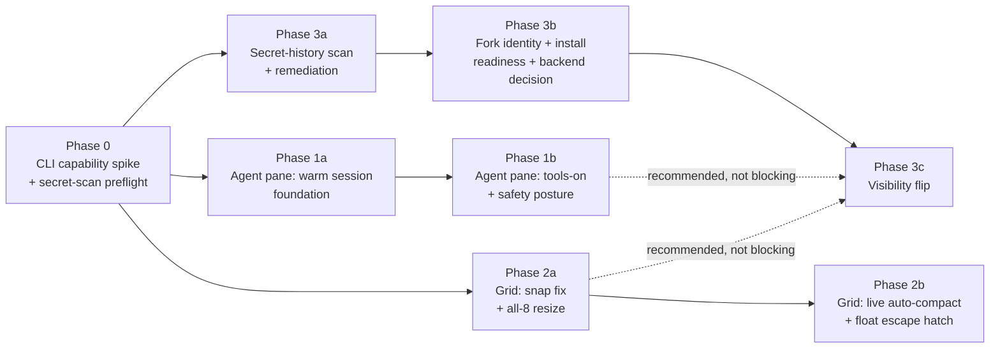

# Agent Pane, Grid/Resize Overhaul, and Public Release — Phased Plan

## How to read this plan

Three workstreams, one dependency-ordered execution order. Each phase has an **Objective**, **File-level changes** (repo-relative paths + symbols, verified against the real source on 2026-07-20), **Acceptance/verification**, and **Risks/rollback**. Phases are sliced so Codex can execute one at a time; sub-phases (1a/1b, 2a/2b, 3a/3b/3c) exist specifically to isolate the highest-risk slices (tools-on, the public flip) behind their own checkpoints.

**Baseline correction (verified via `.git/logs/HEAD`):** two items in the original context brief are **already shipped on `main`**, not open work:
- The `pi` provider (branch `feat/pi-runtime`, commit `5045fb2`, fast-forward merged into `main`).
- The auth-check timeout/inconclusive-fail-open fix (branch `fix/ai-auth-check-timeout`, commit `02fca3f`, fast-forward merged into `main`).

`src/plugins/builtin/ai/providers.ts`, `runner.ts`, and `workspace/pane.tsx` already reflect both. Phase 1 below builds on this baseline — it does **not** re-implement pi support or auth-check reliability.

## Execution order



- **A (agent pane)** and **B (grid)** and **C (public release, Phase 3a/3b)** are file-disjoint and can run in parallel after Phase 0 — no shared files, no shared risk.
- **C's visibility flip (3c)** is the only genuinely gated step: hard-gated on 3a (secret scan clean) and 3b (install readiness + backend decision resolved), independent of A/B by file-dependency. This plan **recommends** (not requires) sequencing 3c after 1b and 2a ship, because a newly public repo with a half-finished tools-on security surface or the known full-width-snap bug increases the blast radius of first public impressions. Zay/CTO makes the final call; the plan does not hard-block on it.

---

## Phase 0 — CLI capability spike + secret-scan preflight

### Objective
Resolve the agent-pane architecture fork with real evidence instead of assumption, and stand up the one piece of Phase-3 tooling this repo currently lacks entirely (no `gitleaks`/`trufflehog`/`detect-secrets` config exists anywhere in the tree — verified via full-repo grep).

### 0.1 — CLI capability spike (claude / codex / pi)

For each of the three provider CLIs already wired in `src/plugins/builtin/ai/providers.ts` (`PROVIDER_DEFS`), run and record:

```sh
# resolve exactly the same binary the app would (use the app's own search path logic)
claude --help
claude --help 2>&1 | grep -iE 'resume|continue|session|input-format|stream-json'
claude --continue --help 2>&1 || true
codex exec --help
codex exec --help 2>&1 | grep -iE 'resume|session|sandbox|ephemeral'
codex --help 2>&1 | grep -iE 'resume|session|interactive'
pi --help
pi --help 2>&1 | grep -iE 'resume|session|-nc|-ne|-ns'
```

**What we already know from the shipped code (`providers.ts`) that grounds the hypothesis the spike must confirm or refute:**
- Claude's structured args already pass `--no-session-persistence` — the flag's *existence* is direct evidence Claude has a native session-persistence mechanism to disable. Claude Code is also publicly documented to support `--continue`/`--resume <id>` for reloading a prior session's own context, and a `--input-format stream-json --output-format stream-json` bidirectional NDJSON mode for a driver process to hold one child alive across turns. **[INFERENCE — public CLI docs, not verified against this machine's installed `claude` binary]. The spike's job is to confirm both exist, AND to confirm what `--resume`/`--continue` actually require of turn 1 (see 0.2's note below — this is the exact flag that must NOT be present on turn 1 if resume is to work).**
- Codex's structured args pass `--ephemeral --ignore-user-config --ignore-rules` on top of `exec` (already the CLI's documented non-interactive one-shot subcommand). `--ephemeral` by name (and Codex's documented one-shot-session semantics) almost certainly means "discard session state on exit" — i.e. the same kind of persistence-suppressing flag as claude's `--no-session-persistence`. Whether `codex exec` exposes a non-ephemeral, persisting mode plus a `--resume`/`--session <id>` flag on top of it needs the spike. **[INFERENCE, unverified]**
- Pi's structured args pass `--no-session` alongside `-nc -ne -ns` — again, existence of a `--no-session` flag implies a session mechanism exists when omitted. Whether it takes a resumable session id or free-running daemon mode needs the spike. **[INFERENCE, unverified]**

### 0.2 — Resolve the architecture fork: recommendation, per provider

**Baseline decision for all three (Opt2 — spawn-per-turn, native session resume):** Each turn still spawns a fresh `Bun.spawn` (as today, via `runWithBun` in `src/plugins/builtin/ai/runner.ts`), but the CLI's own `--resume <session-id>` (or provider-equivalent) flag carries prior context instead of `buildLocalAgentPrompt` (`src/plugins/builtin/ai/workspace/model.ts`) replaying the full transcript. This is the **default, uniform, low-risk path for all three providers** — it fits the existing one-shot stream-capability shape (`run` op in `src/renderers/electrobun/bun/core-capabilities.ts::createAiRunnerCapability`) with no new backend plumbing, and directly kills the unbounded-prompt-growth problem, which is the larger of the two "cold start" costs (process fork/exec is tens of milliseconds; resending an ever-growing transcript is the cost that scales badly and burns the CLI's own context window).

**Load-bearing constraint the fork resolution depends on — resume requires persistence from turn 1, not just a turn-2+ flag swap:** `--resume`/`--continue` reload a session the CLI itself wrote to disk. If turn 1 runs with the flag that *suppresses* that write (`--no-session-persistence` for claude, `--ephemeral` for codex — both verified present in today's structured args), there is nothing for turn 2's `--resume <id>` to resume: the session file was never created. **Enabling resume for a provider therefore means dropping that provider's persistence-suppressing flag starting on turn 1**, not only adding a resume flag on turn 2+. Phase 1a's file-level changes (below) implement this correctly; treat any variant that keeps the suppressing flag on turn 1 while adding `--resume` on turn 2+ as broken — the resume attempt would fail (no session id to resume, or the CLI errors on an unknown/non-existent session).

**Upgrade path for Claude only (Opt1 — persistent bidirectional process), gated on the spike:** *If and only if* the spike confirms `claude --input-format stream-json --output-format stream-json` (or equivalent) keeps one process alive across turns over stdin/stdout NDJSON, recommend upgrading Claude threads specifically to a genuinely warm long-lived process per thread — this is the only provider with public evidence of a machine-oriented persistent protocol; Codex's persistent surface is a PTY-driven interactive TUI (high integration cost, un-scriptable without a PTY layer) and Pi's is unconfirmed. Do **not** build Opt1 for codex/pi unless their own spike results show an equivalent low-effort protocol — if the spike is negative for Claude too, all three stay on Opt2 and "warm" is achieved via 0.3 below instead.

**Rejected: Opt1 for all three uniformly.** Would require a new backend session-lifecycle capability (start/turn/end, keyed by thread id, module-scope process registry in `core-capabilities.ts` — same pattern as the existing `detectedProviders` cache in `providers.ts`), PTY handling for codex's interactive mode, and unconfirmed protocol support for pi. High effort, uneven payoff, and the dominant "replay the whole transcript" cost is already solved by Opt2 alone.

**0.3 — "Warm" without a persistent process, for all three:** stop recreating the isolated `mkdtemp` workspace (`runWithBun` in `runner.ts`, currently `isolatedWorkspace: true` → fresh `mkdtemp(join(tmpdir(), "gloomberb-local-agent-"))` **per message**) on every turn. Create it once **per thread** (on `createLocalAgentThread`), reuse it for every turn in that thread, and only tear it down when the thread is deleted or explicitly reset. This preserves the isolation guarantee (still never the user's real cwd/project) while letting session/tool state that a CLI writes into its cwd (e.g. a resume-session file) persist turn-to-turn — a prerequisite for `--resume` to have anything to resume in some CLI implementations.
**0.3b — Confinement-enforcement spike (per provider) + fallback rule:** "confined default" (Phase 1b invariant 1) is only real if the confinement is actually ENFORCED, not merely requested. Verify per provider what enforces the workspace boundary: codex has `--sandbox workspace-write` (OS-enforced); Claude's `--permission-mode` does NOT OS-confine bash to a directory by itself (the model is *asked* to stay in cwd, but `bash` can `cd /` — real confinement needs an OS sandbox like macOS `sandbox-exec`/seatbelt, version-dependent); pi's tool-sandbox enforcement is unknown. Decide the mechanism: prefer an app-level OS process sandbox (e.g. macOS seatbelt profile scoping writes + network to the per-thread workspace) wrapping the spawn — provider-uniform, defense-in-depth over each CLI's own flags — and note the Windows story (no seatbelt equivalent; document what "confined" means there). **Fallback rule (non-negotiable): any provider whose confinement cannot actually be enforced on the current platform defaults to READ-ONLY (genuinely safe), never silent-YOLO — write/shell/network for that provider then requires the explicit YOLO toggle.** Record the per-provider enforcement verdict + chosen mechanism before Phase 1b implements the confined posture.

### 0.3c — Spike results (VERIFIED 2026-07-20 against installed binaries)

Ran `--help` on the actual installed CLIs. Verdict per provider:

- **claude 2.1.216** (`/Users/master/.local/bin/claude`): resume confirmed (`-r, --resume [id]`, `-c, --continue`, `--session-id <uuid>`, `--fork-session`); suppressor = `--no-session-persistence` (drop for resume). **Warm-process (Opt1) is viable NOW** — `--input-format stream-json` + `--output-format stream-json` + `--include-partial-messages` give a bidirectional NDJSON driver protocol. Tools via `--allowedTools`/`--tools`/`--disallowedTools`, `--add-dir` (scope dirs), `--permission-mode`, `--dangerously-skip-permissions` (YOLO). **Sandbox is settings-driven, NOT a `--help` flag** — Claude Code v2+ has a macOS seatbelt sandbox (filesystem-write allowlist + network disable); `--settings <file-or-json>` accepts inline JSON, so it can be enabled even in headless `--print` mode → **confined-bash IS achievable natively** (verify exact `sandbox.*` settings schema during Phase 1b impl). **Verdict: Opt1 warm process for claude** (resume as crash fallback); confined via `--settings` seatbelt, YOLO via `--dangerously-skip-permissions`.
- **codex 0.144.6** (`/opt/homebrew/bin/codex`): `codex exec resume <id>` confirmed; suppressor = `--ephemeral` (drop for resume); `--json` JSONL stream; `--sandbox {read-only,workspace-write,danger-full-access}` = **real OS-enforced confinement tiers**; `--dangerously-bypass-approvals-and-sandbox` = YOLO. No scriptable bidirectional stdin for `exec`. **Verdict: Opt2 spawn-per-turn + `codex exec resume`; confined = `workspace-write`, YOLO = `danger-full-access`.**
- **pi 0.80.10** (`/opt/homebrew/bin/pi`): `--resume`/`--continue`/`--session <path|id>`/`--session-id` confirmed; suppressor = `--no-session`; `--tools`/`--exclude-tools` allow/deny lists, `--no-tools`. **Correction: `--offline` only disables STARTUP network ops (catalog fetches), NOT inference** — so it was never the cripple; the real cripplers were `--no-tools` + `--no-session` + `-ns`/`-ne`. `--mode rpc` exists = a persistent-protocol candidate for a future warm-process upgrade (like claude). **No OS sandbox** → bash not OS-confined. **Verdict: Opt2 spawn-per-turn + `--resume`/`--session-id`; `--mode rpc` warm-process deferred as a later upgrade.**

**Confinement-enforcement verdict (resolves 0.3b):** **codex** (native `--sandbox workspace-write`) and **claude** (settings-driven v2 seatbelt via `--settings` inline JSON) can BOTH truly OS-confine bash to the per-thread workspace. **Only pi has no known sandbox** — its bash can escape. So confined-bash parity holds for claude+codex out of the box; the open call is pi-only: **(i)** pi confined tier = read/research tools only (no Bash/Write), bash via YOLO — ships now; or **(ii)** wrap pi's spawn in a macOS `sandbox-exec` seatbelt profile for confined-bash parity (macOS-only; Windows needs a separate story). **OPEN for Zay (pi only):** (i) ship-now vs (ii) seatbelt-parity. Until decided, the fallback rule holds for pi: confined = read-only, bash via YOLO. Verify claude's exact `sandbox.*` settings schema and codex `workspace-write` escape-resistance during Phase 1b before relying on either.
**DECISION (Zay, 2026-07-20): pi → option (i), blunt form.** Pi gets no confined-bash tier and no seatbelt wrapper. Pi's confined tier is read/research-only; any pi thread that needs bash/write/network is flipped to YOLO. claude + codex keep native confined-bash (seatbelt-via-`--settings` / `--sandbox workspace-write`). This is the pi behavior Phase 1b implements.

### 0.4 — Secret-history scan preflight (tooling for Phase 3a, stood up now)

No secret-scanning tool exists in this repo today (verified: no `gitleaks`, `trufflehog`, or `detect-secrets` config/binary anywhere in the tree). Phase 0 adds the tool and a baseline config; Phase 3a is the actual gated scan-and-remediate run.

- Add `.gitleaks.toml` at repo root with an explicit allowlist for known false-positive shapes already in the codebase (do not scan-and-panic on these): `src/plugins/builtin/ai/runner.ts::sanitizeRuntimeError` regex literals (`bearer`, `api[_-]?key`, `oauth[_-]?token`, `claude_code_oauth_token` — these are redaction patterns, not secrets), and `src/plugins/builtin/ai/providers.ts::authCheckArgs` (`["auth","status"]`, `["login","status"]` — command literals, not credentials).
- Document the exact scan invocation in this plan (Phase 3a runs it): `gitleaks detect --source . --log-opts="--all" --redact` (full ref history, not just working tree — a public-flip preflight must cover every commit ever pushed, including the squash-merged `feat/pi-runtime`/`fix/ai-auth-check-timeout` history).

### Acceptance / verification
- Spike output recorded (paste `--help` excerpts + the resume/session verdict per provider) into this plan's Phase 1 section before Phase 1a starts — Phase 1a's file-level changes below assume the spike's answer.
- `.gitleaks.toml` present at repo root; `gitleaks detect --source . --log-opts="--all" --redact` runs clean against the *current* allowlist (a dry run now, not the gated Phase 3a run — this just proves the tool + config work).

### Risks / rollback
- Spike reveals none of the three CLIs support native resume: fall back to Opt2 minus resume — keep per-turn spawn, drop full-transcript replay in favor of a **bounded, summarized** history (last N turns + a rolling summary) rather than the unbounded replay today. Note this explicitly as the fallback in Phase 1a's acceptance criteria.
- No rollback risk — Phase 0 is additive tooling + investigation, no product code changes.

---

## Phase 1a — Agent pane: warm-session foundation

### Objective
Eliminate the two real "feels slow" causes verified in the current code — unbounded transcript replay and cumulative (non-delta) chunk delivery — and switch the isolated workspace to per-thread reuse. Tools stay **off** in this sub-phase; that is Phase 1b, deliberately separated because it's the security-sensitive slice.

### File-level changes

**`src/plugins/builtin/ai/workspace/model.ts`**
- `buildLocalAgentPrompt(thread, userText, attachments)` (currently: filters `thread.messages` to `role === "user" || status === "complete"`, joins the **entire** transcript into the prompt every call) — change to emit only the current turn + explicit attachments when the active provider has a confirmed native resume (per Phase 0 spike verdict); keep the current full-replay behavior as the automatic fallback path when a provider has no resume support. Thread the decision through a new `LocalAgentThread.sessionId?: string` field (persisted, opaque — the CLI's own session identifier) set after the first successful turn.
- Add `sessionId` to `LocalAgentThread` interface and to `normalizeLocalAgentWorkspace`'s `isThread` guard (currently checks `id`/`providerId`/`title`/`createdAt`/`updatedAt`/`messages` — extend with an optional string check, no schema-version bump needed since it's additive-optional).

**`src/plugins/builtin/ai/providers.ts`**
- `AiProvider`/`AiProviderDefinition`: add `buildResumeArgs?: (prompt: string, sessionId: string) => string[]` (parallel to existing `buildStructuredArgs`). **Enabling resume for a provider means dropping that provider's session-persistence-suppressing flag starting on turn 1 — not only adding a resume flag on turn 2+** (see Phase 0.2's load-bearing-constraint note: there is nothing to `--resume` if turn 1 never wrote a session). Concretely, this means `buildStructuredArgs` itself changes for a resume-enabled provider (turn 1's args), and `buildResumeArgs` is turn 2+'s variant of that same non-suppressed arg list. Populate per the Phase 0 spike verdict, e.g. (illustrative, confirm exact flag names against the spike output before implementing):
  - **claude, if the spike confirms resume support:** turn 1's `buildStructuredArgs(prompt)` drops `--no-session-persistence` from the existing structured-arg list (`--print prompt --verbose --output-format stream-json --include-partial-messages --safe-mode --tools "" --permission-mode manual` — everything else unchanged); `buildResumeArgs(prompt, sessionId)` is that same non-suppressed list plus `--resume`, `sessionId` (or `--continue`) for turn 2+. **If the spike is negative, `--no-session-persistence` stays in `buildStructuredArgs` exactly as today and the provider stays on the full-transcript-replay fallback — do not add `buildResumeArgs` for a provider whose turn-1 args still suppress persistence.**
  - **codex, if the spike confirms resume support:** turn 1's `buildStructuredArgs(prompt)` drops `--ephemeral` from `exec --skip-git-repo-check --ignore-user-config --ignore-rules --disable shell_tool --sandbox read-only --json <prompt>` (everything else unchanged); `buildResumeArgs(prompt, sessionId)` is that same non-ephemeral list plus `--resume <sessionId>` (or whatever the spike's confirmed flag spelling is) for turn 2+. **If the spike is negative (no persisting mode, or no resume flag on `codex exec`), `--ephemeral` stays exactly as today and codex stays on the full-transcript-replay fallback.**
  - **pi, if the spike confirms resume support:** turn 1's `buildStructuredArgs(prompt)` drops `--no-session` from the existing list (`-p --mode json --offline --no-tools -nc -ne -ns <prompt>`); `buildResumeArgs(prompt, sessionId)` adds whichever resume/session-id flag the spike confirms, for turn 2+. **If the spike is negative, `--no-session` stays and pi stays on the fallback.**
- Extract the returned session id from the CLI's own structured output (Claude/Codex both already emit structured JSONL that likely carries a session id in an envelope event — extend `src/plugins/builtin/ai/stream-events.ts::AiStructuredStreamParser` to capture it; add a `sessionId(): string | null` accessor alongside the existing `result()`).

**`src/plugins/builtin/ai/runner.ts`**
- `runWithBun(...)`: accept an optional `sessionId` and switch `outputMode === "structured"` arg selection to `provider.buildResumeArgs?.(prompt, sessionId) ?? provider.buildStructuredArgs(prompt)` when a session id is present. Because `buildStructuredArgs` itself now differs by provider based on whether resume is enabled for it (see above), this single line correctly picks turn-1-persisting-args-with-no-session-yet vs. turn-2-plus-resume-args vs. the never-changed suppressed-args fallback, with no extra branching needed in the runner.
- `isolatedWorkspace` cwd creation: move the `mkdtemp` call out of `runWithBun` (currently created fresh **per call**) into a new small helper `ensureIsolatedThreadWorkspace(threadId)` that the pane calls once per thread and passes the resulting path in as `cwd` on every subsequent turn; `runWithBun` stops creating/deleting it itself when a caller-supplied isolated `cwd` is present, and the pane (not the runner) owns cleanup on thread deletion.
- **Delta streaming contract change:** `onChunk` currently receives the cumulative `fullOutput` every time (`fullOutput += decoded; onChunk?.(fullOutput)` for plain mode; `nextOutput !== fullOutput` cumulative check for structured mode). Change the callback contract to `onChunk?.(delta: string)` — track `previousLength` and slice, or track the delta directly from `structuredParser.push()`'s return before assigning to `fullOutput`. This is a breaking contract change; update both call sites.

**`src/renderers/electrobun/bun/core-capabilities.ts`**
- `createAiRunnerCapability`'s `run` stream op: `emit({ kind: "chunk", output })` currently forwards the cumulative string; change to forward the delta (`emit({ kind: "chunk", delta })`) matching the new runner contract. Thread `sessionId` through the `input` (renderer passes it) and return it in the `done` emit payload so the renderer can persist it onto the thread.

**`src/renderers/electrobun/view/ai-host.ts`**
- `installElectrobunAiHost`'s `run(...)`: forward `sessionId` in the `capability.subscribe` payload; on `chunk` messages, append `delta` to an accumulator instead of replacing; on `done`, resolve with both the final output and the returned `sessionId`.

**`src/plugins/builtin/ai/workspace/pane.tsx`**
- `sendMessage`: pass `activeThread.sessionId` into `runAiPrompt(...)`; on `controller.done` resolving with a session id, persist it via `updateWorkspace` onto the thread (new `sessionId` field).
- `onChunk: (output) => { streamedOutput = output; setStreamingOutput(output); }` → change to `onChunk: (delta) => { streamedOutput += delta; setStreamingOutput(streamedOutput); }` (matches the new delta contract; `MarkdownText` still re-renders the accumulated string each tick — this phase only changes the transport, not the render granularity).
- Pass the thread's reused isolated workspace path instead of requesting a fresh one per call.

**New/extended tests** (deterministic, pure-function — no live CLI needed, matches this repo's existing test style in `runner.test.ts`/`stream-events.test.ts`/`model.test.ts`/`providers.test.ts`):
- `providers.test.ts`: for a resume-enabled provider, assert `buildStructuredArgs` (turn 1) does **not** contain the persistence-suppressing flag, and `buildResumeArgs` (turn 2+) contains the resume flag + session id + prompt shape. For a provider the spike found no resume support for, assert `buildStructuredArgs` is byte-for-byte unchanged from today (suppressing flag still present) and no `buildResumeArgs` exists.
- `model.test.ts`: `buildLocalAgentPrompt` with a `sessionId` present on the thread returns only the current turn (no transcript join); without a `sessionId`, falls back to today's full-replay behavior.
- `runner.test.ts`: fake-CLI test asserting `onChunk` receives deltas, not cumulative output, for both plain and structured modes; a second case asserting `runWithBun` selects `buildStructuredArgs` (no session id yet) on the first call and `buildResumeArgs` (session id present) on a subsequent call for the same provider.
- `stream-events.test.ts`: parser extracts a session id from a fixture envelope event (per whichever provider(s) expose one).

### Acceptance / verification
- Manual smoke, both renderers: launch TUI (`bun src/index.tsx`) and the dev-build GUI (`bun run desktop:build`), open the agent pane, create a thread for each available provider, send 3+ sequential turns. Confirm (a) the process arg list for turn 1 no longer suppresses session persistence for a resume-enabled provider, and turn 2+'s arg list includes the resume flag (log/print `args` during manual testing, or step through with a debugger — do not ship a permanent debug log), (b) response feels materially faster on turn 2+ than the current full-replay baseline, (c) `MarkdownText` renders correctly with accumulated deltas (no visual regression vs. today).
- `bun test src/plugins/builtin/ai/` passes including the new/extended cases above.
- Existing `bun test src/plugins/builtin/ai/` suite (37+ cases per the last verified run) still passes unmodified where untouched.

### Risks / rollback
- If a provider's resume flag turns out to reload *different* context than our own transcript (e.g. resumes from the CLI's on-disk history rather than exactly what our UI shows), the pane could show a mismatch between displayed history and what the model actually sees. Mitigate: keep the current user-visible transcript display unchanged (source of truth for what's rendered stays `thread.messages`); the resume mechanism only changes what's *sent* to the CLI, and a per-thread "reset session" action (drop `sessionId`, next turn falls back to fresh/full-context) is the rollback path if resume drifts from displayed history — implement this as a visible thread action, not just a code escape hatch.
- Turning off a provider's persistence-suppressing flag from turn 1 is itself a small posture change worth naming explicitly: it means that provider's CLI now writes its own session artifact to disk (in the per-thread isolated workspace, per 0.3) even on a single-turn thread that's never resumed. That's an intended, contained side effect (still inside the isolated per-thread temp dir, still cleaned up on thread deletion) — not a regression, but call it out in review since it's a behavior change independent of the resume feature actually being exercised.
- If session ids leak into persisted `plugin-state` (`workspace/model.ts` persistence) and are provider-account-scoped identifiers, treat them as opaque like today's attachment metadata — no additional exposure since they're not credentials, but note for Phase 1b's security re-review.

---

## Phase 1b — Agent pane: tools-on + safety posture

### Objective
Turn tools on, per the product decision, without turning the agent pane into an unscoped shell/network surface inside a financial terminal. This is the highest-risk slice in workstream A and should get its own `security-review` pass before merge (the two prior clean reviews — `WorkspaceSecurityReview`, `WorkspaceCorrectnessReview` — assessed the tools-**off** baseline; their "no confirmed high/critical" verdict does not carry over once tools are enabled).

### Safety posture (the non-negotiable invariants)

1. **Default posture = full tools, confined to a per-thread workspace.** By default a thread's agent can research, run bash, and write scripts/files freely — but confined to its per-thread isolated workspace (`ensureIsolatedThreadWorkspace` from Phase 1a); it cannot reach the user's real project cwd, home dir, app config/data dir, or portfolio/account data. This is "not crippled" (bash + scripts + write all work) without exposing the real machine. `rm -rf` is possible *inside the workspace* and that's acceptable — the workspace is disposable. **Confinement must be OS-enforced, not advisory (see Phase 0.3b); any provider that can't actually enforce it defaults to read-only, never silent-YOLO.**
2. **YOLO mode is the explicit, warned escalation.** A per-thread toggle lifts confinement — real cwd access + shell + network egress — for when you want the agent to act on your actual machine like a terminal CLI. When active it MUST show a persistent, unmissable banner (e.g. "⚠ YOLO mode — this agent runs shell commands, edits real files, and reaches the network. Be careful."). Off by default; per-thread, never global.
3. **Visible state, not silent capability.** The pane footer (`usePaneFooter("local-agent-workspace", ...)` in `pane.tsx`) always shows the focused thread's posture (e.g. `Tools: confined` vs `Tools: YOLO · Network: on`), at idle and mid-run — the YOLO banner is in addition to, not instead of, this footer line.
4. **Bypass-level flags allowed ONLY inside YOLO.** The confined default uses scoped/workspace-write sandbox modes; full-access flags (Claude accept-all `--permission-mode`, Codex `--sandbox danger-full-access`) are permitted only when a thread is explicitly in YOLO behind the banner — never as the default.
5. **Env allowlist, not inheritance — the single highest-value safety fix.** `src/plugins/builtin/ai/command-resolution.ts::resolveAiCliCommand` currently returns `env: { ...process.env, PATH }`, so the spawned CLI inherits the FULL Electrobun backend environment — every broker token / cloud session / API key the app holds. Tools OFF, that's latent; tools ON, a shell/network tool can read and exfiltrate all of it. Replace inherited env with an explicit allowlist (PATH, HOME, LANG/LC_*, TERM, and only the active provider's own auth vars — e.g. `ANTHROPIC_API_KEY`/`CLAUDE_CODE_OAUTH_TOKEN`, `OPENAI_API_KEY`); deny everything else by default. Land this in Phase 1b regardless of which providers get tools — it is the load-bearing precondition for tools-on being shippable at all.
6. **Kill the process GROUP, not just the child.** `src/plugins/builtin/ai/runner.ts` cancel/dispose currently calls `proc.kill()` on the direct child only; a Bash/shell-tool grandchild survives as an orphan still holding whatever env it inherited. Launch tool-enabled runs in their own detached process group and kill the group on cancel/dispose, plus a backend-shutdown reaper so app quit can't leak warm tool subprocesses.

### File-level changes

**`src/plugins/builtin/ai/providers.ts`** — per-provider flag changes (illustrative; confirm exact codex/pi sandbox flag names against `--help` output captured in Phase 0 before implementing):
- claude: drop `--tools ""` and `--safe-mode`. **Confined default:** enable Claude's tools (Read/Write/Edit/Bash/Glob/Grep) with cwd pinned to the per-thread workspace and a `--permission-mode` that auto-allows *within* that workspace but grants no open network; **YOLO:** full tools + network, real cwd, accept-all permission mode. Confirm exact flag spellings against the Phase 0 `--help` capture before implementing.
- codex: drop `--disable shell_tool`. **Confined default:** `--sandbox workspace-write` rooted at the per-thread workspace (shell + writes allowed, confined); **YOLO:** `--sandbox danger-full-access` (real cwd + network). Keep `--ignore-user-config --ignore-rules` in both (config/rules authority, unrelated to tools).
- pi: drop `--no-tools`. **Confined default:** tools on, `--offline` kept (no network), cwd = per-thread workspace; **YOLO:** drop `--offline` for pi's scoped-network flag (spike-dependent), real cwd.
- Add `buildToolsArgs?: (prompt: string, opts: { mode: "confined" | "yolo"; sessionId?: string }) => string[]` to `AiProviderDefinition` — explicit tools-on arg shape distinct from `buildArgs`/`buildStructuredArgs`/`buildResumeArgs`, composing on top of whichever turn-1-vs-resume base list Phase 1a set for that provider. **The env-allowlist (invariant 5) applies in BOTH modes — YOLO lifts filesystem/network confinement, never the credential firewall.** Broker tokens stay invisible to the CLI even in YOLO.

**`src/plugins/builtin/ai/workspace/model.ts`**
- `LocalAgentThread`: add `toolMode?: "confined" | "yolo"` (absent/default → `confined` = full tools scoped to the per-thread workspace, per invariant 1; `yolo` = explicit un-confined escalation). This replaces a plain tools on/off — tools are ON by default (Zay's "don't cripple it"); the toggle only chooses confined vs unconfined.
- Extend `isThread` guard accordingly (additive-optional, no schema bump).

**`src/plugins/builtin/ai/workspace/pane.tsx`**
- `WorkspaceProviderChooser` (thread creation) + an in-thread control: a visible per-thread **YOLO toggle** (default off = confined). When on, render the persistent warning banner (invariant 2) for that thread. No "enable tools" step — tools are on by default; the only choice is confined vs YOLO.
- `usePaneFooter`: extend the `info` array to always include the tools/network posture line when `activeThread` exists.
- `sendMessage`: pass `activeThread.toolMode` (default `confined`) through to `runAiPrompt` → `runWithBun` → `provider.buildToolsArgs`.

**`src/renderers/electrobun/bun/core-capabilities.ts`**
- `createAiRunnerCapability`'s `run` op: accept and forward `toolMode` from `input`.

**`src/plugins/builtin/ai/command-resolution.ts`**
- `resolveAiCliCommand(command)`: replace `env: { ...process.env, PATH }` with an explicit allowlist-built env (safety invariant 5). Without this, tool-enabled CLIs inherit every credential in the backend process env — this is the change that makes tools-on shippable. Add a test asserting the child env contains only allowlisted keys and none of a seeded broker/cloud token.

**`src/plugins/builtin/ai/runner.ts`** (tools-on hardening)
- Cancel/dispose (currently `processRef?.kill()`, direct child only): for tool-enabled runs, launch in a detached process group and kill the whole group so tool-spawned grandchildren can't orphan; add a run/session reaper invoked on backend shutdown. Keep `sanitizeRuntimeError` on every surfaced error — do not regress its bearer/api-key redaction now that tool output can join the transcript.

### Acceptance / verification
- Manual smoke (both renderers): (a) **confined** thread — prompt it to write + run a script; confirm it works but is confined (list files shows only the per-thread workspace; reading `../../etc/hosts` or a home-dir path is refused; a network action like `curl example.com` is refused). (b) Toggle **YOLO** on for that thread — confirm the warning banner appears, and the same real-cwd read + network action now succeed. (c) A sibling confined thread still refuses both while the YOLO thread allows them (per-thread, not global). (d) In BOTH modes, prompt the agent to print its environment — confirm no broker/cloud token is visible (env-allowlist holds even in YOLO).
- Footer indicator visible and correct in both renderers for a tools-on thread, both at idle and mid-run.
- Route the diff through `security-review` (per this repo's standing review-routing rule) before merge — treat the prior two clean reviews as pre-tools-on baselines that do not carry forward.
- Behavior change (intended, not a regression): existing persisted threads have no `toolMode` → default `confined`, so they gain workspace-scoped tools where before they had none. Call this out in review; if a fully-inert migration is preferred, default pre-existing threads to `confined` explicitly on load (still tools-on) — do not silently leave them tools-off, since tools-on is the product decision. `bun test src/plugins/builtin/ai/` stays green.

### Risks / rollback
- Rollback is a single-field flip: any thread's `toolMode` back to `confined` (or a global kill-switch forcing `confined`) without touching the arg-builder code, since args are computed from `toolMode` every call (no cached/baked state).
- If a provider's own sandboxing turns out to be weaker than documented (spike or later testing reveals workspace-write mode can still escape the temp dir), do not ship tools-on for that provider — fall back to tools-off for it specifically while shipping the others. This is a per-provider decision, not all-or-nothing.

---

## Phase 2a — Grid: partial-width snap fix + all-8 resize (mechanical, both renderers)

### Objective
Fix the two verified UX bugs — full-width forced snapping and single-corner resize — without touching the underlying layout data model. The dock-tree/floating model (`src/types/config.ts::LayoutConfig` — `dockRoot: DockLayoutNode | null` as a binary split-tree with continuous per-split `ratio`, plus `floating: FloatingPaneEntry[]`) is confirmed as a recursive binary partition with continuous ratios, **not** a fixed-column grid. Resolving the requirements doc's open question ("column count... fixed vs adjustable"): **keep the continuous-ratio binary tree as the persisted model — do not introduce a new fixed-N-column data structure.** "Finer column grid" is implemented purely as *finer snap-guide granularity* at drag time; the committed result is still a normal ratio-based split via the existing `applyDrop`/dock-tree mutation path. This is a zero-migration choice: `SavedLayout`/`normalizePaneLayout` need no format change, satisfying requirement 6 (persistence preserved) for free.

### File-level changes

**`src/components/layout/shell/drag/index.ts`**
- `makeSnapGuides(width, height)`: the `top` and `bottom` snap-guide entries currently set `previewRect: { x: 0, y: 0, width, height: halfHeight }` and `previewRect: { x: 0, y: Math.max(0, height - halfHeight), width, height: halfHeight }` — both use the **full** `width`, which is the confirmed bug (corners and left/right already correctly use `halfWidth`). Change both to a configurable fraction of width (not forced full), and add intermediate snap positions beyond the current 4-corner + 4-edge set (e.g. left-third/right-two-thirds, quarter splits) so panes can land at more partial-width positions than just halves. Keep `resolveSnapGuide` (confirmed, same file, `guides.find((guide) => pointInRect(guide.triggerRect, x, y))`) consistent with the new guide set — it only needs the new guides' `triggerRect`s to be non-overlapping, no logic change itself.
- `floatAtRect`-adjacent drop logic (`applyDrop`, `dockPreview.kind === "dock"` branch) is unaffected — it consumes whatever `previewRect`/dock target `makeSnapGuides` hands it, so the fix is isolated to guide geometry.

**`src/components/layout/shell/terminal-pointer-runtime.ts`** (TUI)
- Two duplicated bottom-right-only hitbox checks (`relativeX >= rect.width - 2 && relativeY >= rect.height - 1`, at both the confirmed occurrences) — replace with a hitbox helper that checks all 4 corners (2x2 cell zones at each corner) and all 4 edges (excluding corner zones), returning which of the 8 `FloatingResizeCorner`-or-edge variants was hit. Both occurrences must change identically (they are the duplicated TUI resize-drag-start sites).

**`src/components/layout/shell/native/pointer-runtime.ts`** (GUI)
- `startNativeFloatResize` (confirmed, ~L110): currently takes only a `rect` and always starts a `"float-resize"` drag with no corner/edge discrimination beyond bottom-right (its caller must be gating on a bottom-right-only hit test upstream, since this function itself doesn't check hitbox — trace the caller in the native pane-chrome component that wires up the resize handle DOM elements and confirm/extend it to render and wire 8 handle elements instead of 1, each calling `startNativeFloatResize` with its own corner/edge identifier). Add the corner/edge parameter to `dragRef.current` (`type: "float-resize", paneId, corner, ...`) so the drag-move handler downstream knows which dimension(s) to adjust.

**`src/components/layout/window-edit/mode.ts`**
- `FLOATING_RESIZE_CORNERS: FloatingResizeCorner[] = ["top-left", "bottom-right"]` (confirmed, L38) — expand to all 4 corners + 4 edges. The floating-pane branch mapping (confirmed L174-176: `FLOATING_RESIZE_CORNERS.map((corner) => ({ kind: "floating-resize" as const, corner }))`) will automatically pick up the expanded list once the constant and the `FloatingResizeCorner` type (imported from `../../../plugins/pane-manager`, confirmed at this file's imports — declared inside `src/plugins/pane-manager/`, exact file to confirm while editing) include edge variants (`"top"`, `"bottom"`, `"left"`, `"right"`) alongside the 4 corners.
- `applyWindowEditDirection` (confirmed, L395): routing logic for keyboard-driven resize — extend to handle edge-only resize (adjust one dimension) vs. corner resize (adjust both), matching whatever discriminated shape `FloatingResizeCorner`/the new edge type takes.

**`src/plugins/pane-manager/floating-actions.ts`**
- `resizeFloatingPaneFromCorner(layout, instanceId, corner, ...)` (confirmed L78) — currently branches on corner only; extend the branch (or the `corner` parameter's type) to also accept the 4 edge variants, each adjusting only width or only height from the appropriate anchor side. `moveFloatingPane` (confirmed L61) and `floatAtRect` (confirmed L43) are unaffected — resize and move remain separate operations.

**`src/components/layout/shell/window-mode/overlays.tsx`** and **`src/components/layout/window-edit/status.tsx`**
- Resize-corner preview chrome — extend to render 8 handle affordances (or 4 corner + 4 edge indicators) instead of the current single/bottom-right visual, for both the native and non-native preview paths.

**Test extensions** (this repo already has direct coverage for this surface):
- `src/plugins/pane-manager.test.ts` — extend with edge-resize cases for `resizeFloatingPaneFromCorner`.
- `src/components/layout/window-edit/mode.test.ts` — extend with all-8 keyboard resize cases.
- `src/components/layout/status-bar.test.tsx` — review for any hardcoded single-corner assumption; extend if the status bar surfaces resize-corner state.

### Acceptance / verification
- Manual smoke, both renderers: drag 3+ panes into side-by-side partial-width positions (not full-width) using the corner and edge snap zones — confirm no snap forces full dashboard width. Resize a docked and a floating pane from all 4 corners and all 4 edges via mouse in both renderers, and via keyboard window-edit mode in both renderers.
- `bun test src/plugins/pane-manager.test.ts src/components/layout/window-edit/mode.test.ts src/components/layout/status-bar.test.tsx` green including new cases.
- Regression: load a `SavedLayout` fixture created before this change (or the current default layout on disk) — confirm it opens without corruption, since the persisted model is untouched by this phase.

### Risks / rollback
- Bottom-right-only was likely relied upon by any existing muscle-memory/automation (unlikely given this is an interactive terminal app, but check `pane-manager.test.ts`/`mode.test.ts` for any test asserting bottom-right-*only* behavior — those assertions need updating, not just additive new cases, or they'll false-fail once other corners work).
- The two duplicated pointer-runtime files are the one place TUI/GUI parity can silently drift if only one is updated — both are named explicitly above specifically to prevent that.

---

## Phase 2b — Grid: live auto-compact reflow + float escape hatch

### Objective
Add Grafana/Datadog-style auto-compaction for tiled panes during drag, and a per-pane float/tile toggle that exempts floated panes from compaction while keeping the finer snap zones and all-8 resize from Phase 2a.

### File-level changes

**`src/plugins/pane-manager/gridlock.ts`**
- `gridlockAllPanes(layout, bounds, paneTypes)` (confirmed full function) is currently a one-shot manual retile: collects all docked + floating rects, calls `inferDockTreeFromRects` once, and replaces `dockRoot` wholesale with `floating: []`. This is the "manual gridlock" action, not live-during-drag — keep it as-is for its existing manual-trigger use, and add a **new, narrower function** for live compaction rather than repurposing this one (repurposing would also force-convert all floating panes to docked, which would break the Phase 2b float-exemption requirement).

**`src/plugins/pane-manager/gridlock-inference.ts`**
- `inferDockTreeFromRects(rects, bounds)` and `buildGridDockTree`/`inferSplitCandidate` (confirmed) are the reusable geometric-inference primitives. Add a new exported function, e.g. `inferCompactedDockTree(layout, draggedInstanceId, targetRect, bounds)`, that: takes the **current** dock leaves (excluding floating panes — compaction only applies to tiled panes per requirement 4), substitutes the dragged pane's rect with its drag-preview target rect, and re-runs `inferDockTreeFromRects` restricted to that rect set. This reuses the existing binary-split inference rather than writing a new compaction algorithm.
- Wire this into the TUI and GUI drag-move handlers (`terminal-pointer-runtime.ts` / `native/pointer-runtime.ts`, both from Phase 2a) so that while dragging a **tiled** (non-floating) pane over occupied dock space, the preview shown is the compacted result, not just an overlap/blocked state; on drop, commit via the same dock-tree replacement path `gridlockAllPanes` already uses (`finalizeLayout({ ...layout, dockRoot: <inferred>, floating: layout.floating })` — note: **not** clearing `floating`, since only the dragged pane's own docked neighbors compact, floating panes stay floating).

**Float escape hatch:**
- `src/plugins/pane-manager/floating-actions.ts::floatAtRect` (confirmed, existing) already converts a docked pane to floating at an explicit rect — this is already the tile→float transition primitive; expose it as a first-class user action (a pane-menu item or keyboard shortcut, wherever the existing pane context menu is wired — check `handleNativePaneContextMenu`/`openPaneMenu` in `native/pointer-runtime.ts` and the TUI equivalent) rather than only via drag-to-detach gesture, resolving the requirements doc's open question ("explicit UI affordance vs. drag gesture" — **decision: both**, since a menu action is cheap to add given `floatAtRect` already exists and removes ambiguity about how to escape-hatch a pane that's hard to drag out of a tight tiled layout).
- The reverse (float→tile): `gridlockAllPanes`'s existing floating-rect collection already treats floating panes as gridlock-able when the user explicitly runs "Gridlock All" — for a **single-pane** float→tile action, add a narrow counterpart that docks just that one floating pane into the tree at its current rect (reusing `inferCompactedDockTree` from above with that one pane's rect as the insertion target), exposed the same way (pane-menu action).

**`src/types/config.ts`**
- No new persisted fields needed — `floating: FloatingPaneEntry[]` vs. dock-tree membership already fully encodes tile-vs-float state (confirmed: `LayoutConfig` has both `dockRoot` and `floating` as siblings). This phase changes *behavior* (what happens on drag/menu-action), not the schema.

### Acceptance / verification
- Manual smoke, both renderers: drag a tiled pane into another tiled pane's occupied space — confirm neighbors reflow and compact with no overlap, in both renderers. Float a pane via the new menu action — confirm it does not trigger compaction of its former neighbors, still resizes from all 8 handles (Phase 2a), and can be dragged freely overlapping other panes. Dock a floating pane back via the counterpart action — confirm it joins the tree without corrupting sibling layout.
- Regression: undo/redo (`src/core/state/app/layout-reducer.ts`) still works across a compact-drag action; detach/pop-out (native OS window) still works and remains excluded from in-window grid mechanics per the requirements doc's explicit scope boundary.
- A×B coupling — agent session survives layout ops: detaching/popping-out or reattaching a pane hosting an active agent thread MUST preserve that thread's session (`sessionId` / any warm process); session lifecycle is keyed by thread id, not component mount lifetime. Verify a mid-thread detach/reattach neither resets the conversation nor kills an in-flight turn.
- `bun test` across `src/plugins/pane-manager.test.ts` and any `gridlock`/`gridlock-inference` test file, extended with compaction-during-drag and float/tile-toggle cases.

### Risks / rollback
- Live-during-drag compaction is the highest-complexity slice in workstream B — if the preview computation (`inferCompactedDockTree`) proves too expensive to run every drag-move tick at full geometry precision, throttle it (recompute on a coarser tick, e.g. every N pointer-move events or Nms, not every raw event) rather than skip correctness; do not ship a compaction that only runs on drop without a live preview, since that regresses the "arrange quickly" value proposition the requirements doc calls out.
- If compaction direction (vertical-only vs. bidirectional — another open question in the requirements doc) proves visually confusing in testing, default to **bidirectional** (matches "push neighbors and close gaps" in the requirements' stated Grafana/Datadog reference behavior) but keep `inferCompactedDockTree` as an isolated function so the direction heuristic can be swapped without touching the drag-handler wiring.
- Cross-branch dependency on workstream A: 2b makes resize continuous, and an agent pane re-wraps its full transcript markdown on every width change. Phase 1a's delta-streaming render change must land before 2b ships — otherwise dragging an actively-streaming agent pane is quadratic (continuous resize x whole-transcript re-render) and 2b's "no regression" acceptance fails on exactly the pane A was meant to speed up. If 1a hasn't merged when 2b is ready, gate 2b on it.

---

## Phase 3a — Secret-history scan + remediation

### Objective
Run the full-history secret scan (tooling stood up in Phase 0.4) and remediate any finding before any visibility change. This plan does not run the scan — Codex executes it as the first concrete action of this phase.

### Steps
1. Run `gitleaks detect --source . --log-opts="--all" --redact` (full ref history — covers every commit ever pushed to this repo, including the now-squashed/merged `feat/pi-runtime`, `fix/ai-auth-check-timeout`, `feat/local-agent-workspace`, `pr/local-ai-workspace` branch histories visible in `.git/logs/HEAD`).
2. For any finding: confirm whether it's a real secret or a false positive matching the `.gitleaks.toml` allowlist patterns from Phase 0 (redaction regex literals, auth-subcommand-name literals). Real findings require history rewrite (`git filter-repo` or equivalent) **before** any public flip — a public GitHub repo's full commit history is visible even for squash-merged branches if the underlying commits were ever pushed to a ref GitHub indexed.
3. Archive the scan output (e.g. `docs/solutions/security/` or an internal artifact — not committed if it contains any sensitive excerpt) as the audit trail gating Phase 3c.

### Acceptance / verification
- `gitleaks detect` exits clean (zero unallowlisted findings) against full history, output archived.

### Risks / rollback
- If a real secret is found in history, this phase's scope expands to history remediation (rotation of the leaked credential + history rewrite + force-push coordination) — treat as a hard blocker on 3c regardless of how far 3b/other phases have progressed.

---

## Phase 3b — Fork identity, install readiness, and the backend-dependency decision

### Objective
Three verified gaps beyond secrets: (1) install/branding artifacts still point at upstream `vincelwt/gloomberb` in places the fork-repointing work (already partially done — see below) missed, (2) the app is hardwired to upstream's cloud backend for both REST and WebSocket traffic, and (3) the release automation isn't yet fork-safe end-to-end. All three are config/docs work, no product-feature dependency on A/B.

### Already done (verified via `.git/logs/HEAD` + direct read) — do not redo
- `electrobun.config.ts::RELEASE_BASE_URL` already points at `https://github.com/raava-solutions/gloomberb/releases/latest/download` (commit "chore(desktop): point updater at the fork, gate notarization").
- `electrobun.config.ts::mac.notarize` already gated behind `!!process.env.GLOOMBERB_NOTARIZE` instead of hardcoded `true`.
- `docs/solutions/developer-experience/gloomberb-fork-local-run-and-release.md` already documents the source-runner wrapper, the updater repoint, local dev-build install, and the manual fork-safe release workaround (`gh workflow disable "Release"` + `gh release create ... --repo raava-solutions/gloomberb` bypassing `scripts/release.sh`).

### Verified remaining gaps (file-level changes)

**`src/updater/github-releases.ts`**
- `const GLOOMBERB_REPO = "vincelwt/gloomberb";` — still hardcoded. This feeds `GITHUB_LATEST_RELEASE_API_URL` (`https://api.github.com/repos/vincelwt/gloomberb/releases/latest`), which is almost certainly used for an in-app "what's new"/changelog or update-check surface. **A fork install today queries vincelwt's GitHub releases API for changelog content while `electrobun.config.ts` downloads update *binaries* from the fork** — an inconsistency that could show upstream's changelog/version under the fork's own version scheme. Change to `"raava-solutions/gloomberb"`. Update `src/updater/github-releases.test.ts` fixtures (currently assert `html_url`/`url` containing `vincelwt/gloomberb/releases/tag/...`) to match.

**`scripts/release.sh`**
- `REPO="vincelwt/gloomberb"` — still hardcoded, used for `gh release view --repo "$REPO"` (checking the latest existing release to build changelog notes against) and implicitly for `gh release create` (re-check the full script body for any other `$REPO` use while editing). Change to `"raava-solutions/gloomberb"`. This retires the manual workaround the fork doc currently documents (`gh release create ... --repo raava-solutions/gloomberb` typed out by hand) — after this fix, `scripts/release.sh` should work directly on the fork without the override.

**`package.json`**
- `"repository": { "type": "git", "url": "https://github.com/vincelwt/gloomberb" }` — update to `"https://github.com/raava-solutions/gloomberb"`. Low-severity (metadata only, no functional effect), but a public fork's own `package.json` pointing at someone else's repo is a provenance smell worth fixing alongside everything else in this phase.

**`electrobun.config.ts`**
- `identifier: "com.vincelwt.gloomberb"` (macOS bundle identifier) — still references vincelwt. Recommend changing to a Raava-owned reverse-DNS identifier (e.g. `com.raava.gloomberb` or similar — confirm with whatever bundle-ID convention Raava uses elsewhere) before any wider distribution; a shared bundle identifier with upstream risks macOS treating the fork's app as "the same app" for Gatekeeper/keychain/notification-grouping purposes if a user ever has both installed. Lower urgency than the backend/network items below, but bundle it into this phase since it's the same file already being touched.

**`README.md`**
- Currently instructs `brew install --cask vincelwt/tap/gloomberb` and links `https://github.com/vincelwt/gloomberb/releases/latest/download/stable-win-x64-GloomberbSetup.exe` for Windows — both install **upstream's** binary, not this fork's. Replace with fork-specific install instructions: point at `raava-solutions/gloomberb` releases (once 3a/3b/3c are done and a release exists there), or — until a signed release pipeline exists for the fork (see the Apple-secrets gap below) — document the `docs/solutions/developer-experience/gloomberb-fork-local-run-and-release.md` source-runner + local dev-build path as the primary install method for fork users, since that doc already proves it works without upstream's signing secrets.

### The mandatory backend-dependency decision (gating item, not an afterthought)

**Verified facts:**
- `src/api-client/request.ts`: `DEFAULT_API_URL = "https://api.gloom.sh"`; `getCloudApiBaseUrl()` falls back to it unless `process.env.GLOOMBERB_API_URL` is set. `SESSION_COOKIE_NAMES = ["__Secure-gloomberb.session_token", "gloomberb.session_token"]` — a real cookie-based session against vincelwt's cloud service.
- `src/api-client/index.test.ts` confirms the WebSocket also targets upstream: `wss://api.gloom.sh/cloud/ws`. **The backend dependency is REST + WS, not just a paywall link** — real-time market data streaming rides the same upstream infrastructure.
- `src/plugins/builtin/account-management/pane.tsx:57`: `CLOUD_UPGRADE_URL = "https://gloom.sh/cloud?upgrade=pro"`.
- `src/plugins/builtin/news/wire/news/footer.ts:7`: `CLOUD_UPGRADE_URL = "https://gloom.sh/cloud"`.
- `.env.example` already documents the override mechanism: `GLOOMBERB_API_URL=http://localhost:3355` — the app already supports pointing at a different backend via env var; the gap is **default posture and discoverability**, not missing capability.
- `LICENSE`: confirmed MIT, upstream = `vincelwt/gloomberb`, attribution "appreciated and encouraged, though not legally required beyond preserving the copyright notice." The flip is legally clean; this is a product/infra decision, not a licensing one.

**Decision required before 3c (pick one, explicitly, and implement it — do not ship the flip on today's silent default):**
- **(a) Default to a backend Raava operates.** Change `DEFAULT_API_URL` (and the WS-URL derivation, wherever `wss://api.gloom.sh/cloud/ws` is constructed from the base URL — trace `delegate.getBaseUrl()` in `src/api-client/socket.ts` back to its source) to a Raava-owned host. Requires standing up (or already having) an equivalent backend service, plus its own auth/session/billing story or an explicit "no cloud features" degraded mode for anything backed only by `gloom.sh`.
- **(b) Require first-run `GLOOMBERB_API_URL` configuration.** Ship no working default; on first run with no `GLOOMBERB_API_URL` set, surface an explicit setup prompt/README-driven step rather than silently falling through to `api.gloom.sh`. Lowest implementation cost (the env-var mechanism already exists) but means cloud-dependent features (chat, cloud quotes, account/billing) simply don't work until configured — acceptable only if those features are non-critical for a fork install's core (local market-data-terminal) use case.
- **(c) Deliberately stay on upstream cloud.** Explicitly verify fork users *can* authenticate against `api.gloom.sh` (does upstream's auth even accept accounts/sessions created by a differently-branded fork client, or does it check an app identifier/version that would reject it?) and that pointing fork users at upstream's paywall/billing (`CLOUD_UPGRADE_URL`) is an acceptable, disclosed choice — document this prominently in the README rather than leaving it silent, since a fork user has no reason to expect their session cookie and WebSocket traffic go to a third party's infrastructure by default.
- **(d) Local-only / no-cloud mode (the true independence play).** The app already ships client-side Yahoo Finance + SEC EDGAR providers (no cloud, no auth). Ship a "no cloud" mode using only those + the user's own IBKR broker + RSS, with the `api.gloom.sh` dependency removed from the default path. Zero backend to build; loses chat, cloud-grade/streaming quotes, tweets, FRED/congress, and cloud sync. The only option that makes the fork independent of a third party without Raava becoming a market-data vendor.

**DECISION (Zay, 2026-07-20): interim (c) — stay on upstream `api.gloom.sh` for now**, with the two (c) caveats mandatory before 3c: (1) verify a Raava-branded fork client actually authenticates against upstream (same client code + cookie names as today, so expected to work — confirm, don't assume), and (2) prominent README disclosure that sessions, WebSocket traffic, and billing route to vincelwt's `gloom.sh` infrastructure and a gloom.sh account is required. Repoint billing CTAs (`CLOUD_UPGRADE_URL`) only if/when a Raava billing surface exists; otherwise disclose they go to upstream.

**Backend contract for a future (a) raava.dev migration — impact analysis (2026-07-20):** pointing `DEFAULT_API_URL` at raava.dev is NOT a config flip. raava.dev would have to implement the full contract the client depends on: REST market data (quotes / batches / fundamentals / financials / statements / history / options / holders / analyst-research / corporate-actions / exchange-rates / FRED / congress / instrument-search — `src/api-client/paths.ts` + `data.ts`); a `/cloud/ws` WebSocket for live quote subscribe/unsubscribe + chat + presence (`src/api-client/socket.ts`); email/password auth + session cookie + email verification + account profiles (`src/api-client/auth.ts`); and the Buildout token endpoint. The **dominant cost is licensed market data** (what gloom.sh actually sells), not the API surface. Gating unknown before (a) can even be scoped: does raava.dev implement any of this contract today? If not, (a) is a multi-week+ backend build and a "do we want to run a market-data backend?" business decision — explicitly OUT of scope for the public flip. Recommended trajectory: (c) now → (d) local-only mode as the low-cost independence play → (a) only if Raava commits to operating the backend.

### GitHub Actions readiness

**`.github/workflows/release.yml`, `.github/workflows/verify-desktop-homebrew.yml`** — both hard-require `APPLE_CERTIFICATE_BASE64`/`APPLE_CERTIFICATE_PASSWORD`/`APPLE_KEYCHAIN_PASSWORD`/`ELECTROBUN_APPLEAPIKEY`/`ELECTROBUN_APPLEAPIKEY_BASE64`/`ELECTROBUN_APPLEAPIISSUER`/`ELECTROBUN_DEVELOPER_ID` (via `: "${VAR:?missing ... secret}"` guards — hard CI failure, not a graceful skip) and `HOMEBREW_TAP_TOKEN` (this one degrades gracefully in `release.yml` — `if [ -z "${GH_TOKEN:-}" ]; then echo "...skipping..."; exit 0; fi` — but `verify-desktop-homebrew.yml` hard-requires it too via a `:?` guard). Confirm which of two paths before the flip:
- Disable both workflows on the fork (`gh workflow disable "Release" --repo raava-solutions/gloomberb` and the homebrew-verify one) — matches the existing fork doc's documented workaround — accepting that CI-driven signed releases don't work and the documented local-build path (already proven, see the fork doc) is the release mechanism, **or**
- Provision Raava's own Apple Developer signing secrets + a Raava-controlled Homebrew tap into the fork repo's GitHub Actions secrets, enabling real CI-driven signed releases.
A public repo with an enabled, secret-less workflow produces a visibly red "Release" Action run on every tag push — cosmetic but a bad first impression for a newly public repo; pick one before 3c regardless of which.

### Acceptance / verification
- Fresh clone of the fork on a clean environment; follow the (updated) README install path end-to-end; `gloomberb --version` reports the fork's own version; GUI dev-build boots.
- In-app changelog/update-check surface (fed by `src/updater/github-releases.ts`) shows the fork's own release history, not upstream's — verify by pointing `GLOOMBERB_REPO` at a fork tag and confirming the fetched release matches.
- The chosen backend-dependency option (a/b/c) is implemented and its behavior verified: (a) confirm the app connects to and functions against the Raava-operated backend; (b) confirm a fresh install with no `GLOOMBERB_API_URL` surfaces the setup requirement rather than silently reaching `api.gloom.sh`; (c) confirm fork-branded sessions actually authenticate against upstream and the disclosure is present in the README.
- `bun test src/updater/` green after the repo-string fixture updates.
- `.github/workflows/release.yml`/`verify-desktop-homebrew.yml` disposition (disabled vs. fork-secrets-provisioned) decided and applied.

### Risks / rollback
- Changing `DEFAULT_API_URL` (option a) is a one-line change with a large blast radius if the Raava-operated backend isn't actually ready — verify the target backend is live and matches the expected REST/WS contract *before* merging this change, not after. Keep `GLOOMBERB_API_URL` override intact regardless of which option is chosen, so an operator can always redirect at runtime without a rebuild.
- Rewriting git history for Phase 3a findings (if any) invalidates existing clones/forks-of-the-fork; coordinate timing with anyone else who has cloned `raava-solutions/gloomberb` before force-pushing a rewritten history.

---

## Phase 3c — Visibility flip

### Objective
Flip `raava-solutions/gloomberb` from private to public on GitHub.

### Preconditions (hard gates)
- Phase 3a: secret-history scan clean (or all findings remediated + history rewritten if needed).
- Phase 3b: install readiness verified end-to-end, backend-dependency decision implemented and verified, GitHub Actions workflow disposition decided and applied.

### Recommended (not hard-gated) preconditions
- Phase 1b (agent-pane tools-on) shipped and merged — avoids a newly public repo carrying an in-flight, security-sensitive change as an open PR/branch.
- Phase 2a (grid snap/resize fix) shipped — avoids the two verified daily-friction bugs being visible in a first public impression.

### Steps
1. Re-verify 3a/3b acceptance criteria are still true at flip time (not just at whenever they were last checked — time may have passed and new commits may have landed).
2. Flip repository visibility via GitHub repo settings (Settings → General → Danger Zone → Change visibility → Public).
3. Immediately re-check `.github/workflows/release.yml`/`verify-desktop-homebrew.yml` disposition is exactly what 3b decided (a public repo can attract external PRs/forks that might interact with these workflows).
4. Spot-check that no dangling private-repo-only assumption exists elsewhere (e.g. any internal-only link, non-public dependency, or Raava-internal reference accidentally left in committed docs — a lighter pass than the Phase 3a secret scan, focused on non-secret internal references).

### Acceptance / verification
- Repo shows public on GitHub; a logged-out, unauthenticated fetch of the repo (e.g. `curl -I https://github.com/raava-solutions/gloomberb` from a session with no GitHub auth) succeeds.
- Fresh, fully external clone (no Raava GitHub org membership) can follow the README install path per Phase 3b's verification.

### Risks / rollback
- GitHub visibility can be flipped back to private if a post-flip issue surfaces (this is the actual rollback path — cheap and immediate), but any information disclosed while briefly public (issues filed, forks made, cached search-engine content) is not retractable. This is why 3a/3b are hard gates rather than best-effort — treat the flip as effectively one-way for anything an external party could have captured in the window it was public, however short.

---

## Cross-cutting notes

- **No workstream touches another's files.** Workstream A (agent pane) is confined to `src/plugins/builtin/ai/**` and the electrobun AI-runner capability bridge; workstream B (grid) is confined to `src/components/layout/**`, `src/plugins/pane-manager/**`, and `src/types/config.ts`; workstream C (public release) touches `README.md`, `package.json`, `electrobun.config.ts`, `src/updater/github-releases.ts`, `scripts/release.sh`, `.github/workflows/*`, `src/api-client/request.ts`, `src/api-client/socket.ts`, `src/plugins/builtin/account-management/pane.tsx`, `src/plugins/builtin/news/wire/news/footer.ts`. Safe to run A, B, and C's non-flip phases in parallel Codex slices.
- **Test posture throughout:** this is a desktop+TUI app — prefer manual/smoke verification for anything visual or requiring a live locally-authenticated CLI (which CI cannot run). Add real regression tests only where a genuine observable-contract change exists and is deterministically testable without a live external CLI or a running desktop shell — called out explicitly per phase above (arg-builder shape, prompt-construction logic, delta-chunk contract, resize-target geometry, dock-tree inference). Do not invent tests for the manual-smoke items (drag feel, visual snap behavior, live process warmth) — verify those by running the app.
- **Branch/PR target:** every phase's work targets the fork's own default branch (`raava-solutions/gloomberb` `main`), never upstream `vincelwt/gloomberb`, per standing fork convention.
